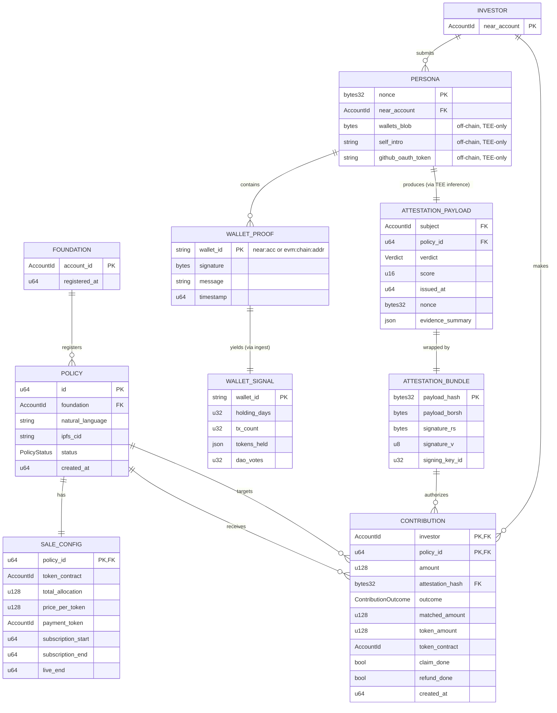

# Buidl-NEAR AI — Entity Relationship Diagram (v2)

> 온체인 엔티티 + TEE 데이터 모델 + 관계를 정의.
> 이 문서는 `PRD.md §4`의 기능 요구사항을 데이터 모델 관점에서 풀어 쓴 것이다.
> 구현 시 `tee/shared` crate가 이 스키마의 진실의 원천(SSOT)이 된다.
>
> **v2 변경점 (2026-04-12 iteration 2)**:
> - `AttestationBundle`: `tee_report` 온체인 struct에서 **제거** (off-chain 전송만). 계산 비용/가스 사유.
> - `ContributionStatus`: `claim_done` + `refund_done` 플래그로 대체. 상태 표 추가 (§5.2b).
> - `SaleConfig`: `live_start`는 **필드로 추가하지 않고**, `live_start := subscription_end`로 불변 정의.
> - `used_nonces`: `LookupMap<[u8;32], ()>`로 고정. 키 공식: `keccak256(policy_id_le_bytes || nonce)`.
> - Canonical message 포맷: `buidl-near-ai|v1|{policy_id}|{nonce_hex}|{ts_ns}|{chain_descriptor}|{address}`로 단일화.
> - Freshness window: **15분 단일 값**. 모든 TEE 검증에 적용.
> - `AccountId` Borsh 인코딩: `String`-backed (len u32 LE + utf-8 bytes). Rust/Python 공통.
> - `Status` (Subscription/Review/Contribution/Settlement/Refund/Claim)는 **오프체인 UI 라벨**이며 온체인 `PolicyStatus`는 오직 4개(Upcoming/Subscribing/Live/Closed).

---

## 1. 엔티티 맵 (전체 개요)



---

## 2. Storage 분할 및 재단 접근권 (프라이버시 모델의 핵심)

엔티티가 어디에 저장되고, 재단이 어디까지 볼 수 있는지가 제품 프라이버시 모델의 진실의 원천이다.

| 엔티티 | On-chain | TEE 메모리 (ephemeral) | IPFS | 재단 접근 |
| --- | --- | --- | --- | --- |
| Foundation whitelist | ✅ (`policy-registry`) | — | — | 본인 계정 |
| Policy (id, foundation, ipfs_cid, status) | ✅ | — | — | ✅ 자기 것 |
| Policy natural_language 원문 | CID만 | 심사 시 fetch | ✅ | ✅ 자기 것 |
| SaleConfig | ✅ | — | — | ✅ |
| **Persona (wallets + self_intro + github token)** | ❌ | ✅ (심사 중만) | ❌ | ❌ **절대 불가** |
| **WalletProof (개별 서명/주소)** | ❌ | ✅ (재검증 후 폐기) | ❌ | ❌ **절대 불가** |
| **WalletSignal (ingest 원본)** | ❌ | ✅ (심사 중만) | ❌ | ❌ **절대 불가** |
| AttestationPayload (= evidence_summary + verdict + score) | ❌ | ✅ (생성 직후 서명) | ❌ | ✅ (서명된 공개 필드) |
| AttestationBundle (on-chain) | ✅ contribute() 인자 | ✅ 생성 | ❌ | ✅ 해시/이벤트 조회 |
| Contribution | ✅ | — | — | ✅ 집계만 조회 |

### 재단이 볼 수 있는 최종 데이터 (읽기 권한 화이트리스트)
- `Policy` (자기 것) — natural_language, ipfs_cid, sale_config, status
- `Contribution` — investor account, amount, outcome, token_amount, timestamps (공개 값)
- `AttestationPayload`에서만:
  - `subject` (NEAR account — contribute 호출자)
  - `verdict`, `score`
  - `evidence_summary` (`wallet_count_*`, `avg_holding_days`, `total_dao_votes`, `github_included`, `rationale(≤280)`)
- `PolicyTotals` — settlement 집계 결과

### 재단이 **절대** 볼 수 없는 데이터 (하드 금지)
- 투자자가 제출한 **개별 NEAR/EVM 지갑 주소**
- 지갑별 잔액, 거래 이력, DAO 투표 상세
- `self_intro` 원문 (또는 그 부분 문자열)
- GitHub login, email, 저장소 이름
- LLM이 내부적으로 사용한 전체 signal (anon_summary dict)
- TEE 내부의 중간 판단 (StructuredRules 외의 것)

> **원칙**:
> 1. 개인 식별 가능 데이터는 **온체인에 절대 쓰지 않는다.** 온체인에는 집계/해시/공개 메타만.
> 2. 재단 대시보드 UI (이번 루프 OUT)는 **evidence_summary 필드 화이트리스트만** 렌더링. wallet list UI는 금지.
> 3. 어떤 컨트랙트 메서드도 TEE 외부로 Persona/WalletProof/WalletSignal 원본을 전달하지 않는다.
> 4. TEE 로그는 개인 식별 필드를 마스킹한다 (NFR-OBS-2).
> 5. `rationale`은 LLM 생성 후 정규식 + self_intro 부분문자열 매칭으로 PII leakage를 검사한 후에만 서명된다 (tee-04).

---

## 3. 타입 정의 (Rust, `tee/shared` crate SSOT)

### 3.1 공통 primitive

```rust
pub type PolicyId = u64;
pub type Nonce = [u8; 32];
pub type Hash32 = [u8; 32];
pub type Timestamp = u64; // nanoseconds since unix epoch (NEAR block timestamp)

use near_sdk::{AccountId, json_types::U128};
```

### 3.2 Policy / SaleConfig

```rust
#[derive(BorshSerialize, BorshDeserialize, Clone, Debug, PartialEq)]
pub struct Policy {
    pub id: PolicyId,
    pub foundation: AccountId,
    pub natural_language: String,   // 자연어 원문 (IPFS 백업과 sanity)
    pub ipfs_cid: String,           // ex) "bafybeib..."
    pub sale_config: SaleConfig,
    pub status: PolicyStatus,
    pub created_at: Timestamp,
}

#[derive(BorshSerialize, BorshDeserialize, Clone, Debug, PartialEq)]
pub enum PolicyStatus {
    Upcoming,
    Subscribing,
    Live,
    Closed,
}

#[derive(BorshSerialize, BorshDeserialize, Clone, Debug, PartialEq)]
pub struct SaleConfig {
    pub token_contract: AccountId,
    pub total_allocation: U128,        // IDO 토큰 총량
    pub price_per_token: U128,         // payment_token 단위
    pub payment_token: PaymentToken,
    pub subscription_start: Timestamp, // Upcoming → Subscribing
    pub subscription_end: Timestamp,   // Subscribing → Live
    pub live_end: Timestamp,           // Live → Closed
}

#[derive(BorshSerialize, BorshDeserialize, Clone, Debug, PartialEq)]
pub enum PaymentToken {
    Near,
    Nep141(AccountId),
}
```

**불변성(invariants)**:
- `subscription_start < subscription_end < live_end`
- `total_allocation > 0`
- `price_per_token > 0`
- Policy가 생성된 이후 `foundation`, `sale_config.token_contract`, `sale_config.total_allocation`는 변경 불가
- **`live_start := subscription_end`** (별도 필드 없음. Subscribing→Live 전이 시점과 동일)
- `subscription_start > block_timestamp()` at registration time (미래 시점만 허용)

### 3.3 Persona (TEE only)

```rust
/// 투자자가 TEE 엔드포인트로 전송. on-chain에 절대 저장되지 않음.
#[derive(BorshSerialize, BorshDeserialize, Clone, Debug)]
pub struct Persona {
    pub near_account: AccountId,
    pub policy_id: PolicyId,
    pub wallets: Wallets,
    pub self_intro: String,
    pub github_oauth_token: Option<String>,
    pub nonce: Nonce,                 // replay 방지, 컨트랙트에 기록됨
    pub client_timestamp: Timestamp,
}

#[derive(BorshSerialize, BorshDeserialize, Clone, Debug)]
pub struct Wallets {
    pub near: Vec<NearWalletProof>,
    pub evm: Vec<EvmWalletProof>,
}

#[derive(BorshSerialize, BorshDeserialize, Clone, Debug)]
pub struct NearWalletProof {
    pub account_id: AccountId,
    pub public_key: String,           // "ed25519:..."
    pub signature: String,            // base64 (NEP-413 스키마)
    pub message: String,              // canonical (아래 참조)
    pub timestamp: Timestamp,         // nanoseconds
}

#[derive(BorshSerialize, BorshDeserialize, Clone, Debug)]
pub struct EvmWalletProof {
    pub chain_id: u64,
    pub address: String,              // "0x..." (소문자 정규화 권장)
    pub signature: String,            // "0x..." hex, EIP-191 personal_sign
    pub message: String,              // canonical (아래 참조)
    pub timestamp: Timestamp,         // nanoseconds
}
```

### Canonical Wallet Proof Message (v2 통일)

모든 `WalletProof.message`는 다음 **정확한** 포맷을 따라야 한다:

```
buidl-near-ai|v1|{policy_id}|{nonce_hex}|{timestamp_ns}|{chain_descriptor}|{address}
```

- `v1` — 스키마 버전 (hard-coded)
- `policy_id` — 10진수
- `nonce_hex` — 64 hex chars, no `0x` prefix, lowercase
- `timestamp_ns` — 10진수 u64 (nanoseconds since unix epoch)
- `chain_descriptor`:
  - NEAR: `near:{network}` — 예) `near:testnet`, `near:mainnet`
  - EVM: `eip155:{chain_id}` — 예) `eip155:1`, `eip155:8453`
- `address` — NEAR account_id 또는 EVM 주소(소문자). 파이프 문자(`|`)가 address에 포함되면 거부.

### 불변성

- `Persona.wallets.near`와 `Persona.wallets.evm` 합쳐서 최소 1개 지갑 포함
- `client_timestamp`는 TEE 현재 시각 기준 **±15분(= 15 * 60 * 10^9 ns)** 이내 (freshness)
- 각 `WalletProof.timestamp`도 동일 freshness 적용
- 모든 `WalletProof.message`는 위 canonical 포맷을 정확히 따름 (정규식 매치 필수)

### 3.4 WalletSignal (TEE-only, ingest 결과)

```rust
#[derive(Clone, Debug)]
pub struct NearWalletSignal {
    pub account_id: AccountId,
    pub first_seen_block: u64,
    pub holding_days: u32,
    pub total_txs: u32,
    pub native_balance: U128,
    pub fts: Vec<FtHolding>,
    pub dao_votes: Vec<DaoVote>,
}

#[derive(Clone, Debug)]
pub struct EvmWalletSignal {
    pub chain_id: u64,
    pub address: String,
    pub first_seen_block: u64,
    pub holding_days: u32,
    pub tx_count: u64,                // evm nonce 기반
    pub native_balance_wei: [u8; 32], // U256 big-endian
    pub erc20s: Vec<Erc20Holding>,
}

#[derive(Clone, Debug)]
pub struct FtHolding {
    pub token: AccountId,
    pub balance: U128,
    pub first_acquired: Timestamp,
}

#[derive(Clone, Debug)]
pub struct Erc20Holding {
    pub token: String,                 // 0x...
    pub balance_wei: [u8; 32],
    pub first_acquired_block: u64,
}

#[derive(Clone, Debug)]
pub struct DaoVote {
    pub dao: AccountId,
    pub proposal_id: u64,
    pub vote: String,
    pub timestamp: Timestamp,
}

/// 심사에 제공되는 집계 시그널
#[derive(Clone, Debug)]
pub struct AggregatedSignal {
    pub near: Vec<NearWalletSignal>,
    pub evm: Vec<EvmWalletSignal>,
    pub github: Option<GithubSignal>,
    pub partial: bool,                 // 일부 체인 실패 플래그
    pub collection_errors: Vec<String>, // 프라이버시 안전한 요약
}

#[derive(Clone, Debug)]
pub struct GithubSignal {
    pub login_hash: Hash32,            // SHA256(login) — 식별 불가
    pub public_repo_count: u32,
    pub contributions_last_year: u32,
    pub account_age_days: u32,
    pub primary_languages: Vec<String>,
}
```

### 3.5 StructuredRules (LLM 1차 호출 산출물)

```rust
#[derive(Debug, Clone, Serialize, Deserialize)]
pub struct StructuredRules {
    /// 정량 규칙 (전부 optional. 필요한 것만 LLM이 채움)
    pub min_wallet_holding_days: Option<u32>,
    pub min_wallet_age_days: Option<u32>,
    pub min_total_tx_count: Option<u32>,
    pub min_dao_votes: Option<u32>,
    pub min_github_contributions: Option<u32>,
    pub required_token_holdings: Vec<String>, // e.g. ["NEAR", "REF"]
    /// 최종 정성 판정용 프롬프트 (LLM 2차 호출에서 사용)
    pub qualitative_prompt: String,
    /// 카테고리 가중치 (합 = 1.0)
    pub weights: RuleWeights,
}

#[derive(Debug, Clone, Serialize, Deserialize)]
pub struct RuleWeights {
    pub quantitative: f32,
    pub qualitative: f32,
}
```

### 3.6 AttestationPayload / AttestationBundle

```rust
#[derive(BorshSerialize, BorshDeserialize, Clone, Debug, PartialEq)]
pub struct AttestationPayload {
    pub subject: AccountId,
    pub policy_id: PolicyId,
    pub verdict: Verdict,
    pub score: u16,                    // 0..=10000 (basis points)
    pub issued_at: Timestamp,
    pub expires_at: Timestamp,         // 기본: policy.subscription_end
    pub nonce: Nonce,                  // Persona.nonce 그대로
    pub evidence_summary: EvidenceSummary,
    pub payload_version: u8,           // 스키마 버전
}

#[derive(BorshSerialize, BorshDeserialize, Clone, Debug, PartialEq)]
pub enum Verdict {
    Eligible,
    Ineligible,
}

#[derive(BorshSerialize, BorshDeserialize, Clone, Debug, PartialEq)]
pub struct EvidenceSummary {
    pub wallet_count_near: u8,
    pub wallet_count_evm: u8,
    pub avg_holding_days: u32,
    pub total_dao_votes: u32,
    pub github_included: bool,
    pub rationale: String,             // ≤ 280자, 개인 식별 정보 없음
}

// v2: on-chain struct — tee_report 제거
#[derive(BorshSerialize, BorshDeserialize, Clone, Debug, PartialEq)]
pub struct AttestationBundle {
    pub payload: AttestationPayload,
    pub payload_hash: Hash32,          // keccak256(borsh(payload))
    pub signature_rs: [u8; 64],        // secp256k1 ECDSA: r(32) || s(32)
    pub signature_v: u8,               // recovery id, normalized to 0 or 1
    pub signing_key_id: u32,           // which registered TEE address signed
}

// off-chain wrapper (TEE → client) — tee_report는 여기에만 포함
pub struct AttestationBundleWithReport {
    pub bundle: AttestationBundle,
    pub tee_report: Vec<u8>,           // opaque blob: intel_quote + nvidia_payload (JSON)
}
```

> **서명 알고리즘**: secp256k1 ECDSA (Ethereum 호환)
> 이유: NEAR AI Cloud TEE가 secp256k1를 사용 (research/near-ai-tee-notes.md §4 참조).
> 컨트랙트는 `env::ecrecover`로 서명자 address를 복원하고 등록된 address와 비교.
>
> **tee_report는 왜 온체인에 없나**: TEE report는 수 KB~수 MB 크기의 opaque blob으로, 온체인에 저장하면 storage/gas 비용이 폭증한다. MVP는 off-chain verifier(재단 운영 또는 프론트)가 이 report를 검증하고, 통과한 signing_address만 owner가 `set_tee_pubkey`로 등록하는 구조다. 컨트랙트는 "이미 신뢰된 address"의 서명 검증만 담당.

**불변성**:
- `payload_hash == keccak256(borsh_serialize(payload))`
- `ecrecover(payload_hash, signature_rs, signature_v)` → pubkey → address가 `signing_addresses[signing_key_id]`와 일치
- `expires_at > issued_at`
- `nonce`는 한 Policy 내에서 유일 (컨트랙트가 set으로 관리)
- `signature_v ∈ {0, 1}` (27/28은 클라이언트가 정규화)

### 3.7 Contribution / ContributionStatus

```rust
// v2: claim_done/refund_done 플래그 추가, enum 단순화
#[derive(BorshSerialize, BorshDeserialize, Clone, Debug, PartialEq)]
pub struct Contribution {
    pub investor: AccountId,
    pub policy_id: PolicyId,
    pub amount: U128,                  // 투자자가 예치한 금액
    pub attestation_hash: Hash32,      // AttestationBundle.payload_hash
    pub outcome: ContributionOutcome,  // settlement 결과 (Pending 동안은 NotSettled)
    pub matched_amount: U128,          // settlement 후 확정. 0 = 미매칭
    pub token_amount: U128,            // settlement 후 확정. matched_amount / price_per_token
    pub token_contract: AccountId,     // claim() 시 ft_transfer 타겟. contribute 시점의 policy에서 캐싱
    pub claim_done: bool,              // 토큰 수령 완료
    pub refund_done: bool,             // 잔여 자금 환불 완료
    pub created_at: Timestamp,
}

#[derive(BorshSerialize, BorshDeserialize, Clone, Debug, PartialEq)]
pub enum ContributionOutcome {
    NotSettled,        // Pending — settle() 전
    FullMatch,         // matched_amount == amount
    PartialMatch,      // 0 < matched_amount < amount
    NoMatch,           // matched_amount == 0
}
```

> **v2 설계 근거**: iteration-1 리뷰에서 "Partial 상태에서 claim만 했을 때 vs refund만 했을 때" 표현 불가능 문제 지적. `outcome`은 settlement 결과(불변), `claim_done`/`refund_done`은 이후 진행 상태(가변)로 분리.

---

## 4. 관계 (Relationship) 상세

### 4.1 Foundation ↔ Policy (1:N)
- 한 재단은 여러 Policy를 등록 가능
- `policy-registry` 컨트랙트는 foundation whitelist를 관리
- Policy 등록 시 `predecessor_account_id`가 whitelist에 있어야 함

### 4.2 Policy ↔ Contribution (1:N)
- 한 Policy에 다수의 Contribution
- 매 Contribution은 `policy_id`로 참조
- `(investor, policy_id)` 쌍은 유니크 (중복 예치 금지, FR-IE-3)

### 4.3 Persona ↔ AttestationPayload (1:1)
- Persona 제출 → TEE 심사 → 1개의 AttestationPayload 생성
- Persona.nonce = AttestationPayload.nonce (동일)
- Persona는 심사 후 폐기, AttestationPayload만 서명되어 반환

### 4.4 AttestationBundle ↔ Contribution (1:N)
- 같은 Bundle은 **다른 Policy에 재사용 불가** (payload에 policy_id 박혀있음)
- 같은 Bundle은 **같은 (investor, policy_id)로 한 번만 사용** (nonce 소모)

### 4.5 Wallet ↔ WalletSignal (1:1)
- 매 지갑마다 1개의 시그널 객체
- 수집 실패 시 해당 지갑은 `collection_errors`에 기록되고 제외 (best-effort)

---

## 5. State Machine (상세)

### 5.1 Policy status 전이 (v2)

> **중요**: 온체인 `PolicyStatus` enum은 **정확히 4개**: `Upcoming / Subscribing / Live / Closed`.
> ONE_PAGER §5의 Subscription / Review / Contribution / Settlement / Refund / Claim은 **오프체인 UI 라벨**이며, 온체인 상태에 존재하지 않는다. 온체인은 Phase만 본다.

```
                  t >= subscription_start              t >= subscription_end            settle() complete
    Upcoming  ──────────────────────────────▶ Subscribing ────────────────────▶ Live ──────────────────▶ Closed
        │           (advance_status, perm)        │       (advance_status, perm)    │    (mark_closed, escrow only)
        │                                         │                                  │
        └── skip ✗ ────────────────────────────────┘                                  │
```

**전이 트리거 (v2)**:
- `Upcoming → Subscribing`: `policy_registry.advance_status(id)` (permissionless keeper). 조건: `block_timestamp >= subscription_start`. 조건 미충족 시 **no-op** (현재 status 반환, 이벤트 발행 없음).
- `Subscribing → Live`: `policy_registry.advance_status(id)` (permissionless). 조건: `block_timestamp >= subscription_end`. no-op 동일.
- `Live → Closed`: **오직** `policy_registry.mark_closed(id)`. **caller == ido_escrow 계정만 허용**. 트리거는 `ido_escrow.settle()`가 모든 Contribution을 처리 완료한 시점에 cross-contract call로 호출.

**advance_status는 Live → Closed를 수행하지 않는다.** 시도 시 no-op.

**mark_closed 호출 조건**:
- `predecessor == stored_escrow_account` (owner가 `set_escrow_account`로 사전 등록)
- `settle_cursor[policy_id] == policy_investor_count[policy_id]` (전부 settled)
- 현재 status == `Live`

### 5.2 Contribution 상태 전이 (v2: outcome + 플래그)

**초기**: 생성 직후 `outcome = NotSettled`, `claim_done = false`, `refund_done = false`.

```
contribute()
    ↓
┌─────────────────────────────────────┐
│ outcome = NotSettled                │
│ claim_done = false                  │
│ refund_done = false                 │
└─────────────────────────────────────┘
    ↓ settle(policy_id)
    │ (compute matched_amount, token_amount)
    ↓
┌─────────────────────────────────────────────────┐
│ outcome ∈ {FullMatch, PartialMatch, NoMatch}    │
│ (settlement 이후 outcome은 불변)                  │
└─────────────────────────────────────────────────┘
    ↓                          ↓
  claim()                    refund()
  (allowed if                (allowed if
   outcome ∈ {FullMatch,      outcome ∈ {PartialMatch, NoMatch}
              PartialMatch}   AND refund_done == false)
   AND claim_done == false)
```

### 5.2b 허용 동작 표 (outcome × 플래그 별 가능한 호출)

| outcome | claim_done | refund_done | claim() 가능? | refund() 가능? |
| --- | --- | --- | --- | --- |
| `NotSettled` | false | false | ❌ NotSettled | ❌ NotSettled |
| `FullMatch` | false | false | ✅ | ❌ NothingToRefund (matched==amount) |
| `FullMatch` | **true** | false | ❌ AlreadyClaimed | ❌ NothingToRefund |
| `PartialMatch` | false | false | ✅ | ✅ |
| `PartialMatch` | true | false | ❌ AlreadyClaimed | ✅ |
| `PartialMatch` | false | true | ✅ | ❌ AlreadyRefunded |
| `PartialMatch` | true | true | ❌ AlreadyClaimed | ❌ AlreadyRefunded |
| `NoMatch` | false | false | ❌ NothingToClaim (matched==0) | ✅ |
| `NoMatch` | false | true | ❌ NothingToClaim | ❌ AlreadyRefunded |

**전이 규칙**:
- `claim()`: `matched_amount > 0 AND claim_done == false` → `claim_done = true`, ft_transfer(token_amount)
- `refund()`: `amount - matched_amount > 0 AND refund_done == false` → `refund_done = true`, native transfer(refund_amount)
- `outcome`은 settlement 이후 절대 변하지 않음 (불변)

### 5.3 TEE 인스턴스 상태 (서버 관점)

```
  idle ─── receive Persona ──▶ ingesting ─── signals ok ──▶ reasoning ─── verdict ──▶ signing ─── ok ──▶ idle
                                 │                                                       │
                                 │ timeout/error                                         │ signing fail
                                 ▼                                                       ▼
                               error                                                    error
```

---

## 6. Settlement 매칭 알고리즘 (기본값)

> PRD §4.3 FR-IE-4의 구체 규칙. 루프에서 필요 시 수정.

**정책**: **Pro-rata with cap**

1. `total_demand = sum(Contribution.amount where outcome == NotSettled)`
2. `total_supply = sale_config.total_allocation * sale_config.price_per_token`
3. `ratio = min(1.0, total_supply / total_demand)`
4. 각 Pending(NotSettled) contribution에 대해:
   - `matched_amount = floor(amount * ratio)`
   - `token_amount = matched_amount / price_per_token`
   - `outcome = if matched_amount == amount { FullMatch } else if matched_amount == 0 { NoMatch } else { PartialMatch }`
5. 나머지(Refund할 금액)는 `amount - matched_amount`로 계산. `refund()`가 나중에 호출될 때 사용.

**장점**: 공정, 구현 단순, 고래 페널티 없음 (이미 Attestation으로 필터링됨)
**단점**: 미세 dust 발생 (floor 처리)

---

## 7. Invariant 체크리스트 (컨트랙트 테스트에서 검증)

- [ ] Policy 생성 후 `subscription_start < subscription_end < live_end`
- [ ] `sum(Contribution.amount)`는 overflow하지 않는다 (U128)
- [ ] `sum(matched_amount) <= total_supply` (공급 초과 불가)
- [ ] `sum(token_amount) <= total_allocation`
- [ ] 한 investor당 policy_id별 contribution은 1개
- [ ] AttestationBundle의 nonce가 한 policy 내에서 유일 (double-spend 불가)
- [ ] `payload.policy_id == contribution.policy_id`
- [ ] `payload.subject == msg.sender`

---

## 8. 인덱싱 전략 (컨트랙트 storage)

### `policy-registry`
- `policies: UnorderedMap<PolicyId, Policy>`
- `foundations: UnorderedSet<AccountId>` — whitelist
- `next_policy_id: u64`
- `by_status: LookupMap<PolicyStatus, Vector<PolicyId>>` (P1)

### `attestation-verifier`
- `signing_addresses: LookupMap<u32, [u8; 20]>` — key index → Ethereum address (20 bytes)
- `current_key_id: u32`
- `retired_grace_until: LookupMap<u32, u64>` — 이전 키의 grace period 만료 timestamp (ns)
- `owner: AccountId`

### `ido-escrow`
- `contributions: LookupMap<ContributionKey, Contribution>` where `ContributionKey = [u8; 32] = sha256(account_id_bytes || policy_id_le)`
- `used_nonces: LookupMap<[u8; 32], ()>` — replay 방지. **키 공식**: `keccak256(policy_id_le_bytes(8) || nonce(32))` = 32 bytes
- `policy_pending_total: LookupMap<PolicyId, U128>` — settlement 전 Pending 합계
- `policy_investors: LookupMap<u64, AccountId>` with counter — Vector-in-LookupMap 대신 flat key `(policy_id << 32) | index`
- `policy_investor_count: LookupMap<PolicyId, u32>`
- `settle_cursor: LookupMap<PolicyId, u32>` — 다음 settle() 호출이 이어갈 offset
- `policy_totals: LookupMap<PolicyId, PolicyTotals>` — settlement 완료 시 저장
- `config: Config` — policy_registry / attestation_verifier 주소

---

## 9. 버전 관리

- `AttestationPayload.payload_version`: 현재 `1`
- 스키마 변경 시 증가. 컨트랙트는 지원하는 버전 화이트리스트 유지.
- `tee/shared` crate는 workspace-level version 관리로 컨트랙트와 동기화.

---

## 10. ERD 검증 체크리스트

- [x] 모든 PRD §4 FR의 데이터가 어느 엔티티에 속하는지 명시됨
- [x] 온체인 vs TEE vs IPFS 분할이 명확함
- [x] State machine 전이가 컨트랙트 메서드와 매핑됨
- [x] Invariant가 테스트 가능한 형태로 기술됨
- [x] Settlement 알고리즘 기본값이 지정됨
- [ ] `tee/shared` crate 실제 파일과 일치 (구현 단계에서)
- [ ] 제3자 리뷰 1회 이상 통과

---

**이 ERD는 `tee/shared` crate의 설계 명세이다.** 구현은 이 문서와 한 줄도 틀어지면 안 된다. 변경 발생 시 ERD → PRD → 태스크 순으로 전파한다.
